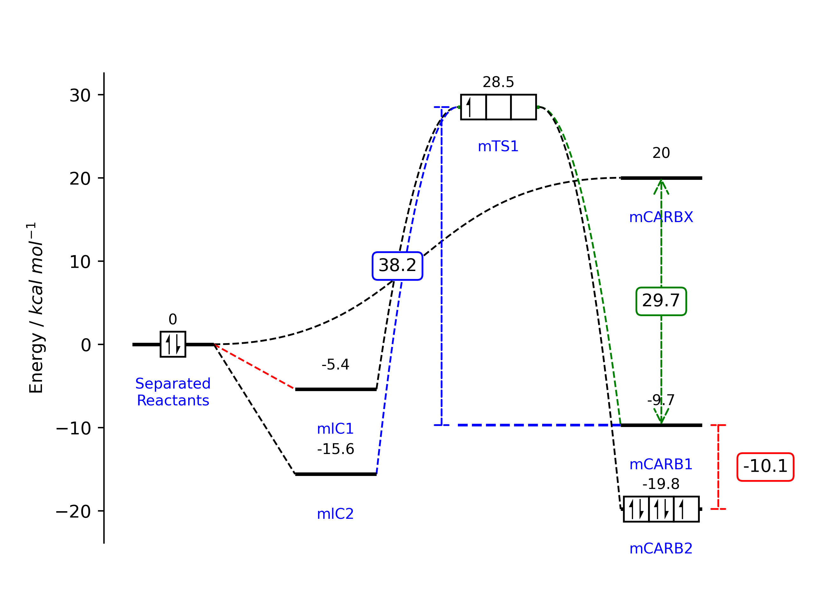

# PyEnergyDiagrams
[](https://zenodo.org/badge/latestdoi/79893385)

PyEnergyDiagrams allows the plotting of energy profile diagrams using Python and Matplotlib.


## Installation
If you are new to Python, the easiest way to get started is to use a distribution like [Anaconda](https://www.anaconda.com/). Then you can use the terminal to install the module using pip:

    pip install git+https://github.com/giacomomarchioro/PyEnergyDiagrams

The only requirement is [matplotlib](http://matplotlib.org/users/installing.html), which is installed by default using Anaconda.

## How to use it?


```python
from energydiagram import ED
diagram = ED()
diagram.round_energies_at_digit = 2
diagram.bottom_text_fontsize = 'small'
diagram.top_text_fontsize = 'small'
diagram.offset = 2
diagram.add_level(0, 'Separated\nReactants')
diagram.add_level(-5.4, 'mlC1')
diagram.add_level(-15.6, 'mlC2', 'last',)  #Using 'last'  or 'l' it will be together with the previous level
diagram.add_level(28.5, 'mTS1', color='g')
diagram.add_level(-9.7, 'mCARB1')
diagram.add_level(-19.8, 'mCARB2', 'last')
diagram.add_level(20, 'mCARBX', 'last')
```
Show the IDs (red numbers) to understand how to link the levels:

```python
diagram.plot(show_IDs=True)
```


Add the links using `diagram.add_link(starting_level_ID,ending_level_ID)`:
```python
diagram.add_link(0, 1, color='r')
diagram.add_link(0, 2)
diagram.add_link(2, 3, color='b', line_order=2)  # change line order to make a curved link
diagram.add_link(1, 3, line_order=2)
diagram.add_link(3, 4, color='g', line_order=2)
diagram.add_link(3, 5, line_order=2)
diagram.add_link(0, 6, line_order=3)
# now we create the plot, this will update the figure
diagram.plot(ylabel="Energy / $kcal$ $mol^{-1}$") # this is the default ylabel
```
To show it you can use `diagram.fig.show()` while for saving it use `diagram.fig.savefig('myEnergyDiagra.pdf')`.

## Electron boxes
The electron boxes can be added using:
```python
diagram.add_electronbox(level_id=0, boxes=1, electrons=2, side=3, spacing_f=3)
diagram.add_electronbox(3, 3, 1, 3, 3)
diagram.add_electronbox(5, 3, 5, 3, 3)
```
The electron spin is automatically changed following the aufbau principle.

```python
from energydiagram import ED
diagram2 = ED()
diagram2.add_level(0,'2pxy',top_text='')
diagram2.add_level(10,r'$\sigma*$',top_text='')
diagram2.add_level(5,r'$\pi*$','last',top_text='')
diagram2.add_level(-5,r'$\pi$','last',color='g',top_text='')
diagram2.add_level(-10,r'$\sigma$',top_text='',position='l')
diagram2.add_level(0,'2pxy',top_text='')
for i in range(1,5):
    diagram2.add_link(0,i,color='g')
    diagram2.add_link(i,5,color='b')
diagram2.add_electronbox(level_id=0, boxes=1, electrons=2, side=1.5, spacing_f=2.5)
diagram2.add_electronbox(1,2,0,1.5,3)
diagram2.add_electronbox(2,5,10,1.5,3)
diagram2.add_electronbox(3,3,4,1.5,3)
diagram2.add_electronbox(4,3,2,1.5,3)
diagram2.add_electronbox(5,3,5,1.5,3)
diagram2.offset *= 1.5
diagram2.plot()
```

## Arrows between levels
You can caluclate the energy betwen two layers and show arrows using:

```python
diagram.add_arrow(3, 4, position='left', color='blue')
diagram.add_arrow(6, 4, position='center')
diagram.add_arrow(5, 4, position='right', color='r')
```

## Troubleshooting and fine-tuning
Most of the time, there could be a problem with text padding. Some parameters can be changed in this way.
```python
diagram.offset = 10
```


To make the change effective, you must use the command `diagram.plot()` again. Remember that once you have made a first attempt at plotting. You can adjust the plot as every matplotlib plot. For convenience you can access `ax` and `fig` from the instance of the class.

```python
# we adjust some parameters
diagram.ax.set_ylabel('My label')
diagram.fig.set_figwidth(10)
# don't want tikcs on the y label
diagram.ax.set_yticks([])
# I want to show on the x axis instead
diagram.ax.axes.get_xaxis().set_visible(True)
diagram.ax.spines['bottom'].set_visible(True)
diagram.ax.set_xlabel("My x label")
# we replot the figure (sometimes we have to resize with the mouse the figure so we force to refresh)
# diagram.fig.show()

```
If you use the command `diagram.plot()` now all the changes will be overwritten, so these minor adjustment must be done after.

## Testing

```bash
python3.12 -m unittest tests/test_energydiagram.py
```


### Contributors
Thanks to Kalyan Jyoti Kalita for the arrow functionality and O2-AC, agrass15268 for bug fixing.
